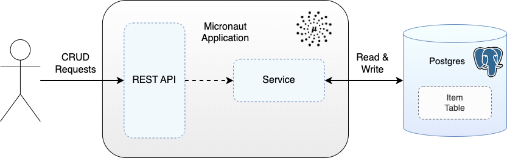

# Micronaut & Java Demo with a Postgres Database

Demo Micronaut application written in Java exposing a REST API to enable performing of CRUD operations on an entity that is persisted to Postgres.

<div style="text-align:center"></div>
<p style="text-align: center;"><I>Figure 1: Micronaut application with Postgres</I></p>

Demonstrates using both a standard JVM-based application and a native image using GraalVM.  GraalVM compiles the Java application ahead of time into a platform-specific native binary executable. This native executable does not require a Java runtime environment to execute. Instead, it can be executed directly on the target platform.  This can lead to faster startup times and reduced memory footprint compared to running on the JVM.

## Running The Demo

The project requires Java 21 to build.

Start the Postgres Docker container:
```
docker-compose up -d
```

Build and test the Micronaut application, and then run, with:
```
./gradlew clean test
./gradlew run
```

Alternatively, following tests, build a native executable with GraalVM (version 21) - [install instructions](https://www.graalvm.org/latest/docs/getting-started/) - and then run the executable:
```
./gradlew clean test
./gradlew nativeCompile
./gradlew nativeRun
```
The standard `test` task is used as using the `@MicronautTest` annotation on the integration tests is not compatible with Kotlin/Native.

In a terminal window use curl request to create (which returns a location header), retrieve, update and delete an item:
```
curl -i -X POST localhost:9001/v1/items -H "Content-Type: application/json" -d '{"name": "test-item"}'
curl -i -X GET localhost:9001/v1/items/653d06f08faa89580090466e
curl -i -X PUT localhost:9001/v1/items/653d06f08faa89580090466e -H "Content-Type: application/json" -d '{"name": "test-item-update"}'
curl -i -X DELETE localhost:9001/v1/items/653d06f08faa89580090466e
```

## Component Tests

The component tests bring up the application and Postgres in docker containers and call the application via its REST API to create, retrieve, update, and delete an item.

For more on the component tests see: https://github.com/lydtechconsulting/component-test-framework

Build the Micronaut application jar, followed by the Docker container:
```
./gradlew clean build
docker build -t ct/micronaut-rest-java:latest .
```

Alternatively, build a native executable with GraalVM, followed by the Docker container:
```
./gradlew clean nativeCompile
./gradlew dockerBuildNative
```

Run component tests:
```
./gradlew componentTest --rerun-tasks
```

Run tests leaving containers up:
```
./gradlew componentTest --rerun-tasks -Dcontainers.stayup=true
```

Note that `--rerun-tasks` is required for subsequent runs when no change has happened between test runs.

## Docker Clean Up

Manual clean up (if left containers up):
```
docker rm -f $(docker ps -aq)
```

# Native Image Errors...

Error starting Micronaut server: Bean definition [org.hibernate.SessionFactory] could not be loaded: Error instantiating bean of type  [org.hibernate.SessionFactory]

Message: No classes have been predefined during the image build to load from bytecodes at runtime.
Path Taken: SessionFactoryPerDataSourceFactory.buildHibernateSessionFactoryBuilder(SessionFactoryBuilder sessionFactoryBuilder)

jvmArgs('-agentlib:native-image-agent=config-output-dir=config,experimental-class-define-support')


ERROR i.n.h.s.BouncyCastleAlpnSslUtils - Unable to initialize BouncyCastleAlpnSslUtils.
java.lang.ClassNotFoundException: org.bouncycastle.jsse.BCSSLEngine
at java.base/jdk.internal.loader.BuiltinClassLoader.loadClass(BuiltinClassLoader.java:641)

systemProperty 'org.graalvm.nativeimage.imagecode', 'bouncyCastleProvider=false'

Still fails.
